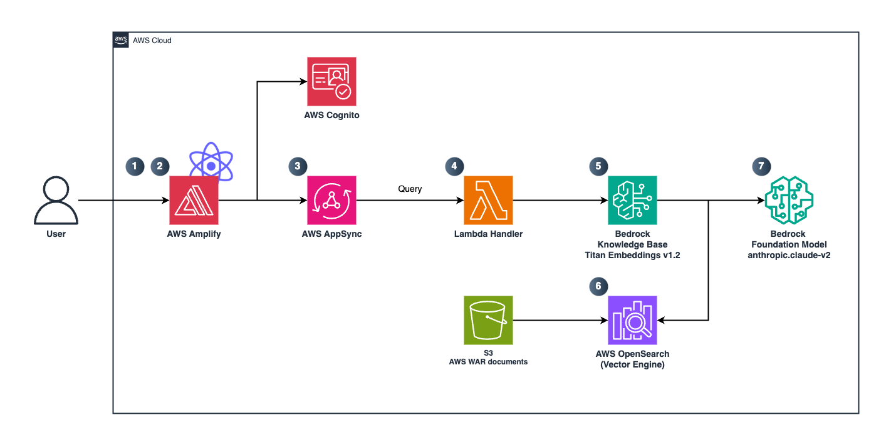

# Virtual Assistant with AWS Amplify Gen 2 and AWS Bedrock
This project is part of the Cevo blog post (link here) which describes how to create a custom virtual assistant with AWS Bedrock and AWS Amplify
Everything you need to understand what is necessary for the project, please check it out the blog post.

## Architecture


1. User is authenticated to the web application through AWS Cognito. 
2. After authentication user is requested to prompt his questions to the virtual assistant 
3. Front-end triggers a GraphQL API query to a Lambda handler. 
4. Lambda submits the query to a knowledge base via AWS Bedrock API, converting this query into a vector embedding using AWS Bedrock. 
5. AWS Bedrock converts the query into embeddings. 
6. By using the now query embedded in the OpenSearch vector database. AWS Bedrock retrieves the most relevant documents stored on its DataSource (S3 bucket) based on their semantic similarity to the query. 

## Pre-Requisites
### Backend configuration file
Removed from the repository, you will need to create a configuration file with the following attributes:
Folder: amplify/constants.ts
Source
```
export enum BACKEND_CONFIG {
  AWS_ACCOUNT_ID = "<value>",
  BEDROCK_KNOWLEDGE_BASE_ID = "<value>",
  BEDROCK_KNOWLEDGE_BASE_NAME = "<value>",
  BEDROCK_FOUNDATION_MODEL_NAME = "anthropic.claude-v2",
  REGION = "us-east-1", // If you want to use another AWS Region, first verify whether Bedrock embedding models and foundational models are available
}

```

## UI


## Deployment
You can deploy the application straight to AWS Amplify or using the new functionality via Amplify Sandboxes. 
To know more about this please verify official documentation
https://docs.amplify.aws/react/deploy-and-host/sandbox-environments/


## AWS Amplify React+Vite Starter Template

This repository provides a starter template for creating applications using React+Vite and AWS Amplify, emphasizing easy setup for authentication, API, and database capabilities.

## Overview

This template equips you with a foundational React application integrated with AWS Amplify, streamlined for scalability and performance. It is ideal for developers looking to jumpstart their project with pre-configured AWS services like Cognito, AppSync, and DynamoDB.

## Features

- **Authentication**: Setup with Amazon Cognito for secure user authentication.
- **API**: Ready-to-use GraphQL endpoint with AWS AppSync.
- **Database**: Real-time database powered by Amazon DynamoDB.

## Deploying to AWS

For detailed instructions on deploying your application, refer to the [deployment section](https://docs.amplify.aws/react/start/quickstart/#deploy-a-fullstack-app-to-aws) of our documentation.

## Security

See [CONTRIBUTING](CONTRIBUTING.md#security-issue-notifications) for more information.

## License

This library is licensed under the MIT-0 License. See the LICENSE file.